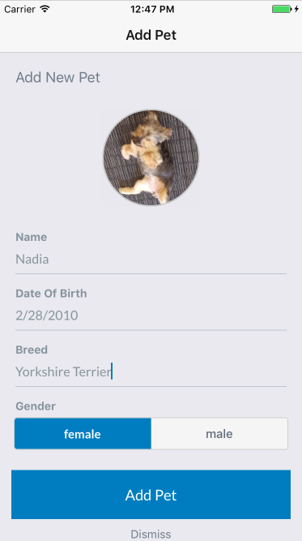
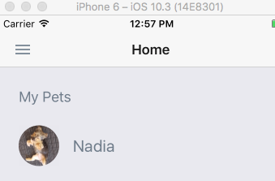

# AWS Mobile React Native Starter App - Serverless Pet Tracker

**Please submit issues to the [aws-amplify](https://github.com/aws/aws-amplify/issues) repository.**

Bootstrap a React Native application on AWS. This starter automatically provisions a Serverless infrastructure with authentication, authorization, image storage, API access and database operations. It also includes user registration and MFA support. The sample use case is a "Pet Tracker" where after a user registers and logs in they can upload pictures of their pet to the system along with information like the birthday or breed.

A companion blog post for this repository can be found in the AWS Mobile Blog: [Announcing: React Native Starter Project with One-Click AWS Deployment and Serverless Infrastructure](https://aws.amazon.com/blogs/mobile/announcing-react-native-starter-project-with-one-click-aws-deployment-and-serverless-infrastructure/). 

This starter uses the [AWS Amplify JavaScript library](https://github.com/aws/aws-amplify) to add cloud support to the application.

### Quicklinks
 - [Getting started](#getstarted)
 - [Using Registration and Login components in your app](#advanced-auth)
 - [Accessing Cloud APIs with REST](#restclient)
 - [Storing images, video and other content in the cloud](#storage)
 - [Modifying Cloud Logic with Lambda for your app](#lambdamodify)

## Architecture Overview


AWS Services used:
* Amazon Cognito User Pools
* Amazon Cognito Federated Identities
* Amazon API Gateway
* AWS Lambda
* Amazon DynamoDB
* Amazon S3
* AWS Mobile Hub

## Prerequisites
- AWS Account
- [Xcode](https://developer.apple.com/xcode/) / [Android Studio](https://developer.android.com/studio/index.html)
- [Node.js](https://nodejs.org/) with NPM 
  - `npm install -g react-native-cli`
  - `npm install -g create-react-native-app`
- [AWS Mobile CLI](https://github.com/aws/awsmobile-cli)
  - `npm install -g awsmobile-cli`
- (_Optional_) [Watchman](https://facebook.github.io/watchman/)
  - On macOS, it is recommended to install it using [Homebrew](https://brew.sh/)
    - `brew install watchman`
- (_Optional_) [AWS CLI](https://aws.amazon.com/cli/)  

## Getting Started <a name="getstarted"></a>

1. Create your backend resources and download the sample code inside of my-project folder.
    ```
    $ awsmobile start my-project react-native
    ```


2. Finally run the app:

    ```
    $ cd my-project
    $ npm install
    $ npm run ios #npm run android
    ```

 Done!

## Application walkthrough

1. On a phone or emulator/simulator, open the application
2. Select the **SIGN UP** tab in the lower right to register a new user. You will be prompted to enter a valid email and phone number to confirm your registration.
3. Click **Sign Up** and you will recieve a code via SMS. Enter this into the prompt and press **OK**.
3. From the **Sign In** tab of the application enter the _Username_ and _Password_ of the user you just registered and select **SIGN IN**.
4. A code will be sent via SMS. Enter that code in the prompt and press **OK**.

5. Press the plus (+) button to upload a photo. After selecting a photo select the **Check mark**.
6. Fill out a few details like the name, birthday, breed and gender of your pet. Press **Add Pet** to upload the photo. This will first transfer the photo to an S3 bucket which only the logged-in user has access to, it will then write the record to a DynamoDB table (via API Gateway and Lambda) that is also restricted on a per-user basis.



6. You will see a record of your pet on the homescreen.



## Use features in your app.

This starter app uses AWS Amplify library to integrate with AWS. The library components can be used in your app to easily add capabilities for Authentication, Storage and API access.  

You will need [Create React Native App](https://github.com/react-community/create-react-native-app) for the next sections.

- Create a new React Native App (CRNA) using `create-react-native-app`
- `cd` into your new app dir.
- Eject your react native app (in our examples call it "myapp")
```sh
create-react-native-app <project-directory>
cd <project-directory>
npm run eject # Eject as "React Native"
```
- Download the `aws-exports.js` file from your AWS MobileHub project as outlined earlier in the [Getting started](#getstarted) section. Place it in the root of your new CRNA directory.


### Authentication <a name="advanced-auth"></a>

1. Install dependencies with `npm install`

2. Install additional dependencies:

```
npm install aws-amplify --save
npm install aws-amplify-react-native --save
```

3. Link the native components by running: `react-native link`

4. Open the `App.js` file.

5. Import the `Auth` module from the library and your aws-exports here
```javascript
import Amplify from 'aws-amplify';
import { withAuthenticator } from 'aws-amplify-react-native';
import {awsmobile} from './aws-exports';
```

6. Edit your App component to transform it into one that suports `Auth`  
```javascript
Amplify.configure(awsmobile);
export default withAuthenticator(class App extends React.Component {
  // ...
});
```
7. Test it!
`npm run ios # or android`

The withAuthenticator component adds Sign Up, Sign In with MFA and Sign Out capabilites to your app out of box. You can either use this Higher Order Component, or build your own UI and use the APIs from [Amplify](https://github.com/aws/aws-amplify/blob/master/media/authentication_guide.md) too.


### Cloud APIs and Backend Access Control<a name="restclient"></a>
In order to access resources in your AWS account that are protected via AWS [Identity and Access Management](http://docs.aws.amazon.com/IAM/latest/UserGuide/introduction.html) you will need to sign your requests using the [AWS Signature Version 4](http://docs.aws.amazon.com/general/latest/gr/signature-version-4.html) signing process. The starter app uses the API component from [Amplify](https://github.com/aws/aws-amplify) to make signed requests to your API's endpoint.

To make Authenticated calls to your API, you will need to use the library Auth component first to get the Authentcated AWS Credentials. You can make unauthenticated requests to your API too.   

1. Install additional dependencies  
`npm install aws-amplify-react-native --save`

2. Import the `aws-exports.js` file
```javascript
import awsmobile from './aws-exports';
```

3. Import the API component from the library
```javascript
import Amplify, { API } from 'aws-amplify';
```

4.Configure Amplify //you can skip this step if Amplify was already configured in the previous section on Auth
```javascript
Amplify.configure(awsmobile)
```

5. Edit your App component to use Amplify's API functions to make REST calls to your API as follows:   
```javascript
async function getData() { 
    let apiName = 'MyApiName';
    let path = '/path';
    let myInit = { // OPTIONAL
        headers: {} // OPTIONAL
    }
    return await API.get(apiName, path, myInit);
}
```

6. Test it!  
`npm run ios # or android`

7. You can now invoke API Gateway APIs from your React Native that are protected via AWS IAM. You can use other REST calls as shown in this guide for [AWS Amplify API component](https://aws.github.io/aws-amplify/media/api_guide)

### Storing content in the cloud <a name="storage"></a>
Many applications today provide rich media such as images or videos. Sometimes these are also private to users. AWS Amplify Storage module gives a simple mechanism for managing user content in public or private storage.

The `Storage` component requires AWS Credentials to make calls to S3. If you need to store data in private folders for users, you will need to complete the Auth section first. Please follow steps from the earlier [Authentication](#advanced-auth) section.

1. Import Storage component from the library
```javascript
import Amplify, { Storage } from 'aws-amplify'
```

2. Import the `aws-exports.js` file if you haven't already
```javascript
import awsmobile from './aws-exports';
```

3. Configure Storage using your aws-exports if you haven't already
```javascript
Amplify.configure(awsmobile);
```

4. Call Storage APIs in your code
```javascript
Storage.put('yourFile.txt', 'your key', {
        level: 'private', //access control level
        contentType: 'text/plain' 
    })
    .then (result => console.log(result))
    .catch(err => console.log(err));
```
Amplify Storage component provides users with APIs to perform PUT, GET, REMOVE and LIST bucket objects. The component is also configurable to store data in either private (Authenticated) folder or the public one. This can be specified using the `level` option with the call. 
To learn more about the UI components and other API calls for Storage, please refer the [AWS Amplify Storage Guide](https://aws.github.io/aws-amplify/media/storage_guide)

5. Test it!  
`npm run ios # or android`


## Modifying Express routes in Lambda <a name="lambdamodify"></a>

The sample application invokes a Lambda function running [Express](https://expressjs.com) which will make CRUD operations to DynamoDB depending on the route which is passed from the client application. You may wish to modify this backend behavior for your own needs. The steps outline how you could add functionality to _"delete a Pet"_ by showing what modifications would be needed in the Lambda function and the corresponding client modifications to make the request.

1. After you have cloned this repo, locate `./aws-mobile-react-native-starter/backend/lambdas/crud/app.js` and find the following section of code:

```javascript
app.listen(3000, function () {
  console.log('App started');
});
```

1. Immediately **Before** this code (_line_72_) add in the following code:

```javascript
app.delete('/items/pets/:petId', (req, res) => {
  if (!req.params.petId) {
    res.status(400).json({
      message: 'You must specify a pet id',
    }).end();
    return;
  }

  const userId = req.apiGateway.event.requestContext.identity.cognitoIdentityId;

  dynamoDb.delete({
    TableName: PETS_TABLE_NAME,
    Key: {
      userId: userId,
      petId: req.params.petId,
    }
  }, (err, data) => {
    if (err) {
      console.log(err)
      res.status(500).json({
        message: 'Could not delete pet'
      }).end();
    } else {
      res.json(null);
    }
  });
});
```

2. Save the file and in the Mobile Hub console for your project click the **Cloud Logic** card. Expand the **View resource details** section and note the name of the **Lambda function** in the list for the next step. It should be something similar to **Pets-itemsHandler-mobilehub-XXXXXXXXX**.

3. In a terminal navigate to `./aws-mobile-react-native-starter/backend` and run:

```
npm run build-lambdas
aws lambda update-function-code --function-name FUNCTION_NAME --zip-file fileb://lambdas/crud-lambda.zip
```

**REPLACE the FUNCTION_NAME with your Lambda function name from the previous step.**

This might take a moment to complete based on your network connection. Please be patient.

Alternatively you could click the Lambda function resource in the Mobile Hub console which opens the Lambda console and press the **Upload** button on that page to upload the **lambdas/crud-lambda.zip** file.

5. Now that you've updated the Cloud Logic backend modify the client to call the new API route. In the `./aws-mobile-react-native-starter/client/src/Screens` directory edit `ViewPet.jsx`

  - Add the following imports
```javascript
import { Button } from 'react-native-elements';
import awsmobile from '../../aws-exports';
import API from '../../lib/Categories/API';
```

  - Add the following function **BEFORE** the **render()** method:
```javascript
  async handleDeletePet(petId) {
    const cloudLogicArray = JSON.parse(awsmobile.aws_cloud_logic_custom);
    const endPoint = cloudLogicArray[0].endpoint;
    const requestParams = {
      method: 'DELETE',
      url: `${endPoint}/items/pets/${petId}`,
    }

    try {
      await API.restRequest(requestParams);

      this.props.navigation.navigate('Home');
    } catch (err) {
      console.log(err);
    }
  }
```

  - In the `return` statement of the `render` method add in a new button after the `<View style={styles.breaker} />`:
```javascript
// ...
      <View style={styles.breaker} />
      <Button
          fontFamily='lato'
          backgroundColor={colors.red}
          large
          title="DELETE PET"
          onPress={this.handleDeletePet.bind(this, pet.petId)} />
// ...
```
6. Save the file and run the application again:

```
cd ./aws-mobile-react-native-starter/client
npm run ios # or android
```

If you have previously uploaded any pets click on their thumbnail from the main page (if not upload one now). You should see a new button **DELETE PET**. Click on it and the pet should be removed from the screen. The record should also have been removed from the DynamoDB table. You can validate this by going to the **Resources** section of your Mobile Hub project and opening up the DynamoDB table. 

## Security Information

### Remote Storage

This starter app uploads content to an S3 bucket. The S3 bucket is configured by Mobile Hub to use fine-grained access control to support public, protected and private access, you can find more information [here](http://docs.aws.amazon.com/mobile-hub/latest/developerguide/user-data-storage.html). To learn more about restricting this access further, see [Amazon S3 Security Considerations](http://docs.aws.amazon.com/mobile-hub/latest/developerguide/s3-security.html).

### Local Storage

This starter app uses React Native's [AsyncStorage](https://facebook.github.io/react-native/docs/asyncstorage.html) to persist user tokens locally (accessKeyId, secretAccessKey and sessionToken). You can take further actions to secure these tokens by encrypting them.

### API Handler Table Permissions

The Lambda function in this starter will read and write to DynamoDB and it's role will be granted the appropriate permissions to perform such actions. If you wish to modify the sample to perform a more restricted set of actions see [Authentication and Access Control for Amazon DynamoDB](http://docs.aws.amazon.com/amazondynamodb/latest/developerguide/authentication-and-access-control.html).
